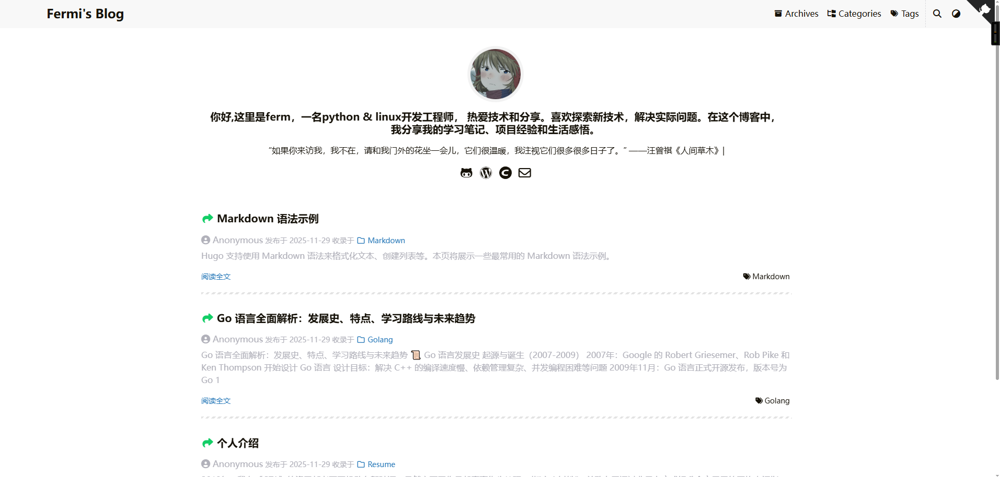

# 一个由hugo+fixlt的博客网站




## 在 `my-blog` 目录中为你的项目创建

```go
hugo new site my-blog

git init

#将 FixIt 主题作为 Git 子模块 添加到你的项目中的 themes 目录。
git submodule add https://github.com/hugo-fixit/FixIt.git themes/FixIt
#在站点配置文件中添加一行，指定当前主题。
echo "theme = 'FixIt'" >> hugo.toml
#在站点配置文件中添加一行，指定默认的内容语言。
echo "defaultContentLanguage = 'zh-cn'" >> hugo.toml
#启动 Hugo 的开发服务器以查看站点。
hugo server
#按 Ctrl + C 停止 Hugo 的开发服务器。
```

## 给你的网站添加新页面

```go
#给你的网站添加新页面。
hugo new content posts/my-first-post.md


#Hugo 在 content/posts 目录中创建了该文件，使用编辑器打开文件。
---
title: 我的第一篇文章
date: 2024-03-01T17:10:04+08:00
draft: true
# ...
---
请注意，front matter 中的 draft 值为 true。默认情况下，Hugo 在你构建网站时不会发布草稿内容。详细了解 草稿、未来和过期内容。


在帖子正文中添加一些 Markdown，但不要更改 draft 值。
---
title: 我的第一篇文章
date: 2024-03-01T17:10:04+08:00
draft: true
# ...
---

博客（英语：Blog）是一种在线日记型式的个人网站，借由张帖子章、图片或视频来记录生活、抒发情感或分享信息。博客上的文章通常根据张贴时间，以倒序方式由新到旧排列。


#保存文件，然后启动 Hugo 的开发服务器来查看站点。你可以运行以下任一命令来包含草稿内容

hugo server --buildDrafts
hugo server -D
hugo server -D --disableFastRender

#由于本主题使用了 Hugo 中的 .Store 来实现一些特性， 非常建议你为 hugo server 命令添加 --disableFastRender 参数来实时预览你正在编辑的文章页面。
#当对新内容感到满意时，将 front matter 中的 `draft` 值更改为 `false`，然后保存文件。
```

## 发布网站

在此步骤中，你将发布你的网站，但不会 *部署* 它。

当你发布站点时，Hugo 在项目根目录的 `public` 目录中创建整个静态站点。这包括 HTML 文件以及图像、CSS 文件和 JavaScript 文件等资源。

当你发布网站时，你通常不希望包含 [草稿、未来或过期的内容](https://gohugo.io/getting-started/usage/#draft-future-and-expired-content)，命令很简单。

```
hugo
```

我们的大多数用户使用 CI/CD 工作流程部署他们的网站，通过推送 [1](https://pre.fixit.lruihao.cn/zh-cn/documentation/getting-started/quick-start/#fn:1)到他们的 GitHub 或 GitLab 存储库会触发构建和部署。流行的提供商包括 [Vercel](https://vercel.com/)[2](https://pre.fixit.lruihao.cn/zh-cn/documentation/getting-started/quick-start/#fn:2)、[Netlify](https://www.netlify.com/)[3](https://pre.fixit.lruihao.cn/zh-cn/documentation/getting-started/quick-start/#fn:3)、[AWS Amplify](https://aws.amazon.com/amplify/)、[CloudCannon](https://cloudcannon.com/)、[Cloudflare Pages](https://pages.cloudflare.com/)、 [GitHub pages](https://pages.github.com/) 和 [GitLab pages](https://docs.gitlab.com/ee/user/project/pages/)。

要了解如何部署站点，请参阅 [托管和部署](https://gohugo.io/hosting-and-deployment/) 部分。

##  文档指南

强烈建议你花少量时间完整阅读 FixIt 主题的文档，以便你更好地了解如何使用它。

1. [安装篇](https://pre.fixit.lruihao.cn/zh-cn/documentation/installation/)
2. [入门篇](https://pre.fixit.lruihao.cn/zh-cn/documentation/getting-started/)
3. [内容管理](https://pre.fixit.lruihao.cn/zh-cn/documentation/content-management/)
4. [进阶篇](https://pre.fixit.lruihao.cn/zh-cn/documentation/advanced/)